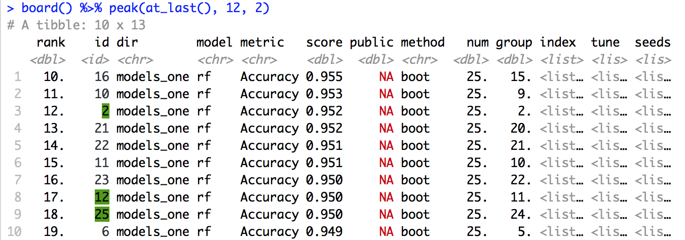

<!-- README.md is generated from README.Rmd. Please edit that file -->

```{r setup, include = FALSE}
knitr::opts_chunk$set(
  collapse = TRUE,
  comment = "#>",
  fig.path = "man/figures/README-",
  out.width = "100%"
)
```
# leadr

The goal of leadr is to stream-line model organization in data science projects and Kaggle competitions. The main function `leadr::board` takes a [caret](https://github.com/topepo/caret) model and automatically builds a personal leaderboard that persists across the entire project. 

This leaderboard allows you to easily sort models by metrics (accuracy, RMSE, etc.) and ensures that you never lose track of a good model during interactive exploratory analysis. 

## Installation

The package is not currently available on CRAN. You can install the development version with:

```r
# install.packages("devtools")
devtools::install_github("tmastny/leadr")
```

## Getting Started

Let's say your task get the best classification accuracy on the iris data set. We start by initializing an R project with this directory:

```
.
└── iris.Rproj
```

And fit our first model. 

```r
library(caret)
model <- train(Species ~ ., data = iris, method = 'glmnet')
```

Before leadr, we might create the script `glmnet_1.R` to record the model, save the `train` object as a [.RDS file](https://www.fromthebottomoftheheap.net/2012/04/01/saving-and-loading-r-objects/), and keep track of the accuracy in a spreadsheet. 

With leadr, we only need to do the following:

```r
leadr::board(model)
```

    ## # A tibble: 1 x 9
    ##     num dir         model  accuracy    cv method tune       seed  resample
    ##    <id> <chr>       <chr>     <dbl> <dbl> <chr>  <list>     <lis>    <dbl>
    ## 1     1 /models_one glmnet    0.965   25. boot   <list [2]> <lis…       1.

`board` creates a personal leaderboard for your project that ranks and sorts your model based on the model's metric. The leaderboard tibble has all the information needed to successfully recreate and document any model.

`leadr::board` also modifies the project directory:

```
.
├── iris.Rproj
├── leadrboard.RDS
└── models_one
    └── model1.RDS
```
At the root `board` saves the leaderboard tibble as a `.RDS` file and creates a subdirectory (named `/models_one` by default) to save all the models. All future models passed to `board` will be added to the leaderboard and saved in the directory.

## Interactive

In the previous example, we did everything from the command line and leadr took care of the organization and documentation. In fact, leadr benefits from interactive use in other ways. For example, leadr uses [pillar](https://github.com/r-lib/pillar) and [crayon](https://github.com/r-lib/crayon) to programmatically color ranking outputs: 

```{r fig.align='center'}

```

## Vignettes

For a full description of the features, check out my vignettes hosted here:

1. Introduction: walkthrough of the basic workflow of leadr

2. Ensembles: demonstrates how leadr facilitates stacked and blended ensemble building. 


