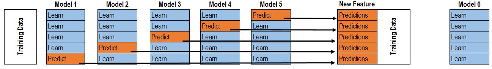

```{r setup, include = FALSE}
knitr::opts_chunk$set(
  collapse = TRUE,
  comment = "#>",
  warning = FALSE,
  message = FALSE,
  cache = TRUE
)
```

```{r echo=FALSE}
unlink(here::here('leadrboard.RDS'))
unlink(here::here('models_one'), recursive = TRUE)
```

This vignette demonstrates advanced features of `leadr`, applied to building an ensemble.

## Ensembles

Ensembles come in two flavors^[Source: https://dnc1994.com/2016/05/rank-10-percent-in-first-kaggle-competition-en/]. The first idea is an averaging ensemble. 

```{r fig.align='center', echo=FALSE}
knitr::include_graphics("model averaging.png")
```

A set of models make predictions, and you average the predictions (or possibly the classification probabilities).

Empirically, a better technique is blended or stacked ensembles:

```{r fig.align='center', echo=FALSE}

```

Here, data is split into k-folds. The model is trained on k-1 folds, then evaluated on each holdout. Combined, each holdout set recovers the original data set. Therefore, the holdout predictions form the new ensemble feature. 

`leadr` has some basic tools that help build these type of blended models. 

## The Task

We will build an ensemble for the iris dataset, which is a multiclass classification dataset. Other packages such as [caretEnsemble](https://github.com/zachmayer/caretEnsemble) do not yet [support](https://github.com/zachmayer/caretEnsemble/pull/191) multiclass ensembles. `leadr` fills this niche nicely. 

First, let's build a list of models.

```{r}
library(purrr)
library(caret)
library(leadr)
```


```{r}
folds <- createFolds(iris$Species, k = 5, returnTrain = TRUE)
control <- trainControl(method = 'cv', index = folds, savePredictions = 'final')

mapped_list <- map(
  c('rf', 'glmnet'),
  ~train(
    Species ~ .,
    data = iris,
    method = .,
    trControl = control
  )
)
```

We explicitly define the cross-validation index, because blending requires that each model is trained on the same set of folds. 

We can also specify additional models using `caretEnsemble`.

```{r}
library(caretEnsemble)
ensemble_list <- caretList(
  Species ~ .,
  data = iris,
  trControl = control,
  methodList = c('rpart', 'knn')
)
```

```{r}
models <- c(mapped_list, ensemble_list)
walk(models, board)
board()
```


## Submodel Selection

We also want to evaluate the models that go into our ensemble. In general, we want to use two different criteria. 

First, we want to maximize accuracy, as measured by the 5-fold cross-validation that we build our models on. Second, we want to minimize the prediction correlation. Suppose two sets of model predictions have similar accuracy scores, are not very correlated. This means that each model learned something different about the dataset, and would likely benefit from an ensemble. 

`caret` offers some nice tools to see these criteria:

```{r}
results <- resamples(models)
summary(results)

modelCor(results)
splom(results)
```

Some of our models are very correlated, which is to be expected for a simple data set.

The next step as described in the introductory diagram, is to create a new feature for each model from the out of fold predictions. `leadr` has a nice helper function for this:

```{r}
blended <- oof_grab(models)
blended
```

Now we fit a final ensemble model on the `blended` data:

```{r}
ensemble <- train(Species ~ ., data = blended, method = 'rf', trControl = control)
ensemble
```

Then we can add it to our leaderboard and see how it compares to the individual models. We'll also take advantage of the `dir` argument of `board`. Saving this model to a new directory called `ensembles` allows a natural grouping of the baseline and ensemble models.

```{r}
board(ensemble, dir = "ensembles")
```


